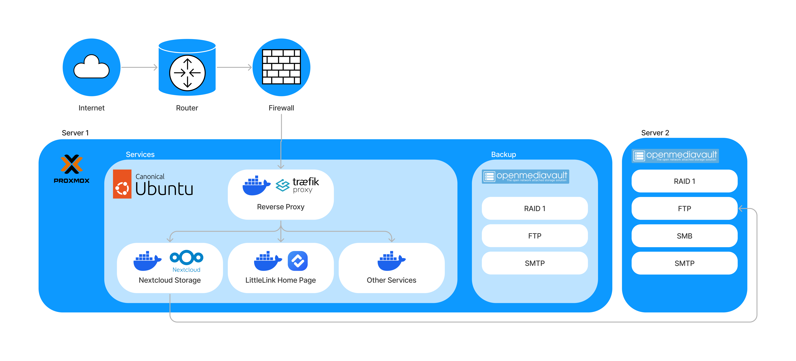

# Gabriel's Home Server

> This Repo contains the docker-compose.yml file for [home.glhweb.com](https://home.glhweb.com) & **Configuration** details of my home server.

### What, Why, How?

This project originally started as a way to teach myself the backend configuration of Websites and APIs but transitioned into a hobby where I provide various online services to myself and peers. All this is done through using a NAS and a repurposed PC in my home.

#### Technologies Used

|                |                                                                                                                                                                                                                                                                                                                                       |
| :--------------- | --------------------------------------------------------------------------------------------------------------------------------------------------------------------------------------------------------------------------------------------------------------------------------------------------------------------------------------- |
| Infrastructure | [Proxmox](https://www.proxmox.com/en/), [Ubuntu](https://ubuntu.com/https:/), [Docker](https://www.docker.com/), [OpenMediaVault](https://www.openmediavault.org/)                                                                                                                                                                    |
| Services       | [Naextcloud](https://hub.docker.com/_/nextcloudhttps:/), [MariaDB](https://hub.docker.com/_/mariadbhttps:/), [Redis](https://redis.io/docs/install/install-stack/docker/https:/), [traefik proxy](https://doc.traefik.io/traefik/), [LittleLink](https://littlelink.io/https:/), [MailHog](https://hub.docker.com/r/mailhog/mailhog/) |
| Connection     | [Cloudflare](https://www.cloudflare.com/en-gb/), [Let's Encrypt](https://letsencrypt.org/)                                                                                                                                                                                                                                            |
| Security       | [fail2ban](https://github.com/fail2ban/fail2ban), Cloudflare WAF, SSL/TLS                                                                                                                                                                                                                                                             |
| Monitoring     | [NetData](https://www.netdata.cloud/), [HealthChecks](https://healthchecks.io/), SMTP alerts, S.M.A.R.T cron jobs                                                                                                                                                                                                                     |
| Tools          | [Tailscale](https://tailscale.com/)                                                                                                                                                                                                                                                                                                   |
| Protocols      | HTTP, HTTPS, SSH, SMB, FTP, SMTP                                                                                                                                                                                                                                                                                                      |

<i>Config Diagram</i>

Here is a gist of what happens when a webpage is accessed on the system. The HTTPS request coming into the system goes to the traefik reverse proxy container. This container is stored in an Ubuntu VM (Services) on the PC (Server 1) running Proxmox. Traefik reads the request, directs it to the respective container, and returns the response to the user.

These different containers in the Services VM provide access to different resources within the network.

For example, when a user is transferring a file on Nextcloud, a cloud storage service similar to Dropbox, it goes through traefik, then to Nextcloud which accesses the filesystem on the NAS (Server 2).
